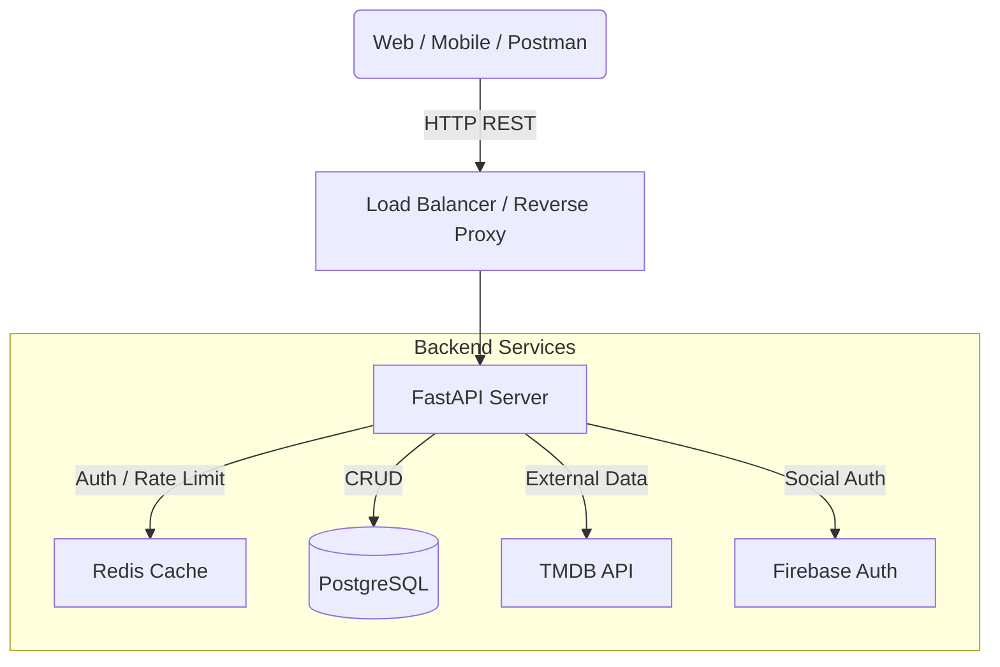

```markdown
# Architecture

FastAPI + SQLModel (PostgreSQL) + Redis

### 개요

본 프로젝트는 영화/콘텐츠 리뷰 플랫폼을 위한 백엔드 API 서버입니다. Python의 **FastAPI** 프레임워크를 기반으로 비동기 처리를 극대화하였으며, **Docker** 환경에서 구동되도록 설계되었습니다. 인증은 JWT를 사용하며, Redis를 통해 토큰 관리 및 성능 최적화를 수행합니다.

## 전체 아키텍처


