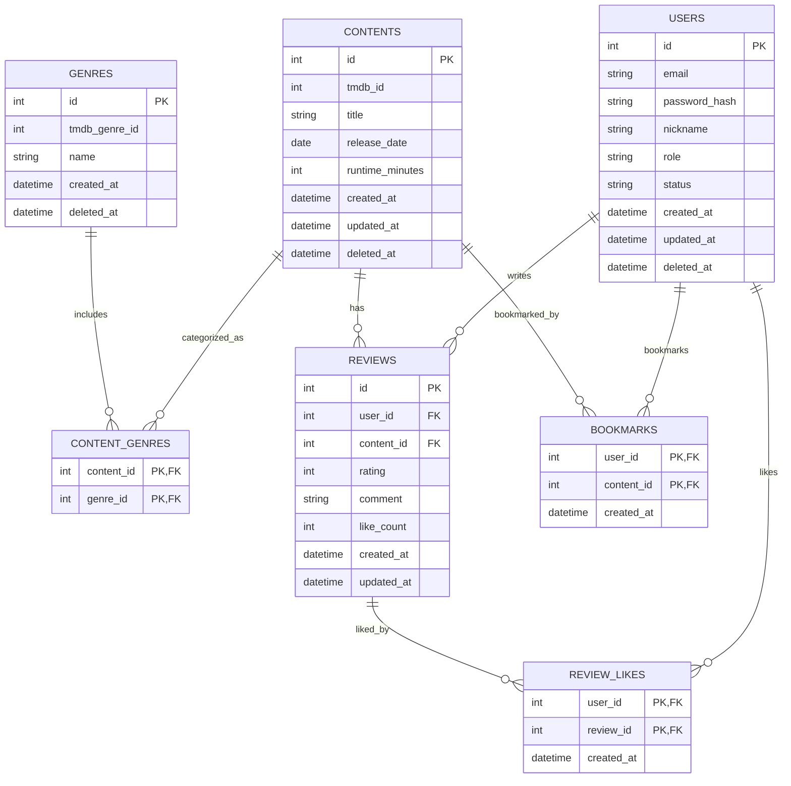

# DB Schema

## 데이터베이스 및 공통 설정

- **PostgreSQL**을 사용하며 `SQLModel` (SQLAlchemy Core 기반) ORM을 통해 스키마를 관리합니다.
- 데이터베이스 마이그레이션은 **Alembic**을 사용하여 버전을 관리합니다.
- 공통적으로 모든 테이블에는 `created_at`이 존재하며, 주요 엔티티(User, Content 등)는 `deleted_at` 컬럼을 이용한 **Soft Delete** 패턴을 사용하여 데이터 복구 가능성을 열어두었습니다.
- **N+1 문제 방지**: SQLAlchemy의 `relationship` 설정 및 조회 시 `joinedload` 또는 `selectinload` 전략을 사용하여 연관 데이터를 효율적으로 가져옵니다.

## 주요 테이블 설명

- **users**: 사용자 계정 정보를 저장합니다. 이메일(Unique), 해시된 비밀번호, 닉네임, 역할(`USER`/`ADMIN`), 상태(`ACTIVE`/`BLOCKED` 등)를 관리합니다.
- **contents**: 영화(콘텐츠) 정보를 저장합니다. TMDB ID를 유니크 키로 가지며, 제목, 개봉일 등의 기본 메타데이터를 보관합니다.
- **genres**: 영화 장르 정보를 저장합니다. TMDB의 장르 ID와 매핑됩니다.
- **content_genres**: 콘텐츠와 장르 간의 **N:M 관계**를 연결하는 중간 테이블입니다.
- **reviews**: 사용자가 콘텐츠에 남긴 평점(1~5)과 코멘트를 저장합니다.
- **review_likes**: 리뷰에 대한 '좋아요' 정보를 저장하는 테이블로, (사용자 ID, 리뷰 ID) 조합은 유니크합니다.
- **bookmarks**: 사용자가 찜한 콘텐츠 정보를 저장합니다.

## DB 다이어그램

